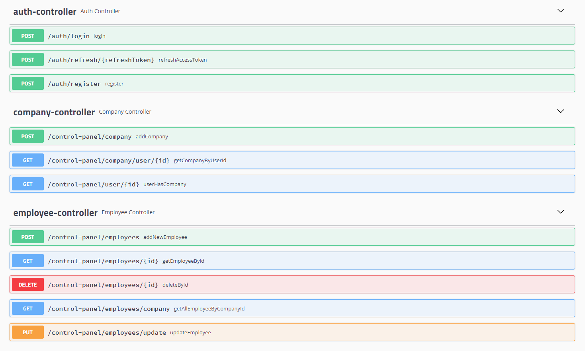

# Employer Assistance
The Employer Assistance System is a web-based application designed to help companies manage their employees effectively.
With this system, companies can add new employees, edit existing ones, and manage employee leave and sick days.
## Features
The application provides the following features:
- Add new employees to the system
- Edit existing employee details
- Mark employees as on leave or sick
- Manage employee payroll

## Technologies

### Backend
- Java
- MVC
- Framework Spring Boot
- Framework Hibernate
- JPA Repository
- Rest API
- MySql
- Documentation API Swagger

## Swagger

## Installation

1. We download Docker desktop and the MySql database and perform the initial configuration. If errors occur, we update and refresh the project using Maven.

2. After successful configuration of the application, you should first launch the Docker container with MySql, and then start the application in the environment. The application will start at http://localhost:8080.
